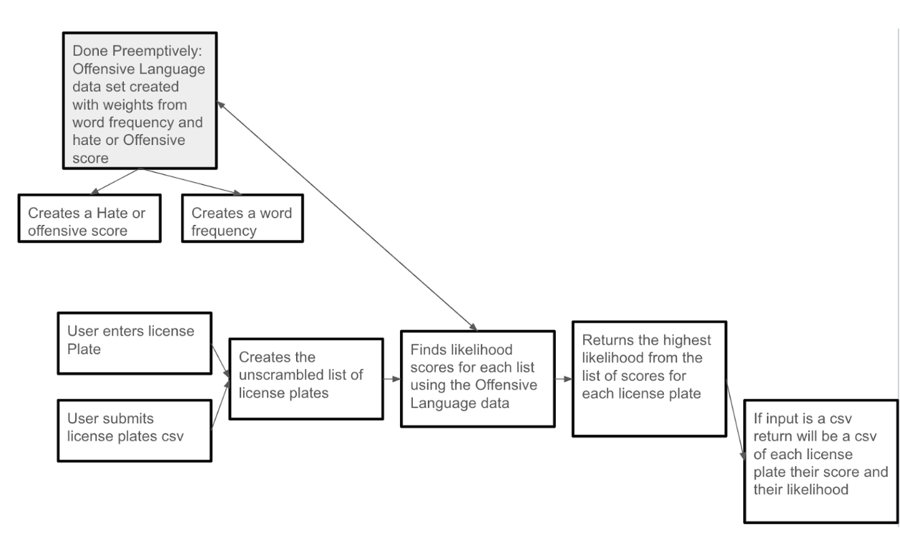

1.  Create a dataset for reference list of hate speech/profanity. This
    component will join with many data sets of abbreviations, hate
    speech, offensive language, slurs, etc….

    **Name**: `master_list`

    **What it does**: clean + combine multiple datasets to create a
    master list of profanity abbreviations, hate speech, offensive
    language, slurs, etc.

    **Inputs** (with type information): None

    **Outputs** (with type information): combined list/dataframe, type
    string

    **Assumptions**: assumes input word exists in `master_list`

2.  Frequency function: Determine frequency of words from reference
    dataset appearing in Twitter Dataset and assign weights based on
    “severeness”

    **Name**: `word_frequency`

    **What it does**: returns frequency table of all words from
    `master_list` appearing in twitter dataset

    **Inputs** (with type information): `master_list`,type string

    **Outputs** (with type information): `word_frequency_list`, type
    numeric

    **Assumptions**:

3.  Hatespeech function: determines if the word is hatespeech or note
    based on the Twitter Dataset

    **Name**: `hate_or_offensive`

    **What it does**: checks if the word appears in tweets deemed as
    “hate-speech” or “offensive-language”

    **Input**: `master_list`

    **Output**: score for hate or offensive (numeric)

    **Assumptions**: the word appears in the list of tweets

4.  Unscrambler function: Creates a list of different interpretations of
    the plate: Takes out all numbers, Takes out all letters, Changes 0
    to O, Changes 3 to E, Changes 1 to Ll Changes 1 to Il Changes 8 to
    B, Changes 4 to A, Changes 2 to Z, Changes 5 to S, Changes 6 to G,
    Changes 6 to B

    **Name:** `unscrambler`

    **What it does:** takes in user license plate and filters
    (“unscrambles”) it Also decides if a word needs to be scrambled or
    not?

    **Inputs** (with type information): `scrambled word`, type string

    **Outputs** (with type information): `unscrambled word`, type string

    **Assumptions**: that the input word does not contain (letter to
    number) scrambling that our program does not recognize

5.  Function: Calculate the scores for each item in the plate scrambled
    list and will return the highest

    **Name**: `scale_function_dict` What it does: combines the two
    scores from `word_frequency` and `hate_or_offensive`

    **Inputs** (with type information): `word_frequency` ,
    `hate_or_offensive` (lists)

    **Outputs** (with type information): dictionary of the word and its
    score

    **Assumptions**:

6.  Function: Checks that the input you gave/the scrambled is in the
    `scale_function_dict`

    **Name:** `scale_function_dict`

    **What it does:** returns the score of your input

    **Inputs** (with type information): `scale_function_dict`,
    `unscrambler`

    **Outputs** (with type information): the score for the specific word
    you inputted

    **Assumptions**: you inputted something that fits the correct format
    (length and no characters that aren't allowed)

7.  Create a csv if the input was a csv.

    **Name:** `csv_outputer`

    **What it does**: checks if you input a csv and then gives you a csv

    **Inputs** (with type information): all of our functions

    **Outputs** (with type information): csv of the original csv

    **Assumptions**: you input a csv

8.  Final website: A user interface that allows a user to enter 1
    license plate to check the likelihood of approval

    **Name**: “Enter License Plate”

    **What it does**: takes user input, provides to our program,
    provides output of likelihood score

    **Inputs** (with type information): desired user license plate, type
    string

    **Outputs** (with type information): likelihood score, type float;
    reason for score, type string

    **Assumptions**:\
    
